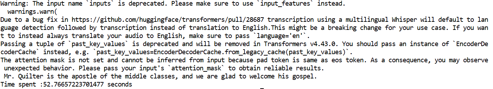
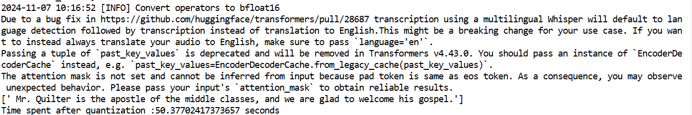

# Neural Compressor

## Usecase:Quantization of Whisper model using neural compressor

### Environment

* Platform:Intel Tiber AI Cloud
* OS version : Ubuntu 22.04
* CPU : Intel(R) Xeon(R) Platinum 8468V

### Environment setup

Step 1. Create and activative the virtual environment

```
# Creating virtual environment
  python3 -m venv asr-quant

# Activating virual environment
  source ~/env/asr-quant/bin/activate
```

Step 2. Install the required dependencies

```bash
pip install requirements.txt
```
Step 3.Below mentioned changes need to be done inorder to run the quantization script.


1. cd /home/<user-name>/env/asr-quant/lib/python3.10/site-packages/transformers/models/whisper

2. In modeling_whisper.py replace
     
     #Line number may vary with respect to transfomer versions
    ```
     expected_seq_length = self.config.max_source_positions * self.conv1.stride[0] * self.conv2.stride[0]
    ``` 

     with

     ```bash
    try:
         expected_seq_length = self.config.max_source_positions * self.conv1.stride[0] * self.conv2.stride[0]
        except AttributeError:
            try:
                expected_seq_length = self.config.max_source_positions * self.conv1.module.module.stride[0] * self.conv2.module.module.stride[0]
            except AttributeError:
                try:
                    expected_seq_length = self.config.max_source_positions * self.conv1.module.module.module.stride[0] * self.conv2.module.module.module.stride[0]
                except AttributeError:
                    expected_seq_length = None 
     ```

3. In generation_whisper.py replace 
    ```
    input_stride = self.model.encoder.conv1.stride[0] * self.model.encoder.conv2.stride[0]
    ```

    with 

    ```
    try:
        input_stride = self.model.encoder.conv1.stride[0] * self.model.encoder.conv2.stride[0]
        except AttributeError:
            try:
                input_stride = self.model.encoder.conv1.module.module.stride[0] * self.model.encoder.conv2.module.module.stride[0]
            except AttributeError:
                try:
                    input_stride = self.model.encoder.conv1.module.module.module.stride[0] * self.model.encoder.conv2.module.module.module.stride[0]
                except AttributeError:
                    input_stride = None 
    ```

    ### Command-line

    ```
    python Whisper_Inference_without_quantization.py 
    
    ```
    
    
    ```
    python Whisper_quantization.py
    ```
    

    ```
    python quantized_inference.py
    ```
    


    


    
