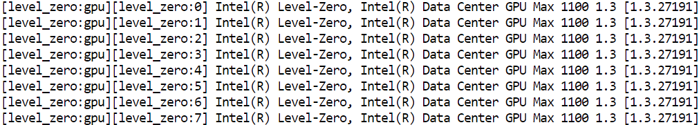
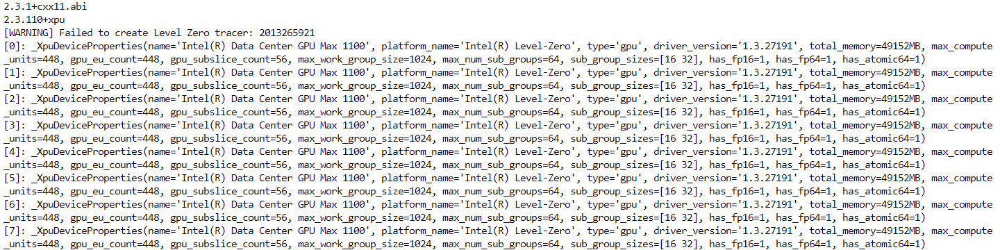

# Multi-Card Inference - Environment Setup

This guide will help you in setting up the environment needed for performing a mult-card inference. 

### 1. Un-set and List SYCL devices

This command reset the oneAPI device selector variable to list all available OpenCL and Level Zero devices present in the ITDC node.

```bash
unset ONEAPI_DEVICE_SELECTOR
sycl-ls
```

Output:



### 2. Create and Activate Python Virtual Environment
```bash
python3 -m venv muti-card_env
source muti-card_env/bin/activate
```

### 3. Installation of PyTorch, TorchVision, TorchAudio and oneCCL bindings for PyTorch
This command installs the latest version of PyTorch, TorchVision, TorchAudio and oneCCL bindings for PyTorch.

N.B.: This command is subject to change as per new releases. Please find the command to install the latest available version [here](https://intel.github.io/intel-extension-for-pytorch/#installation?platform=gpu).

```bash
python -m pip install torch==2.3.1+cxx11.abi torchvision==0.18.1+cxx11.abi torchaudio==2.3.1+cxx11.abi intel-extension-for-pytorch==2.3.110+xpu oneccl_bind_pt==2.3.100+xpu --extra-index-url https://pytorch-extension.intel.com/release-whl/stable/xpu/us/
```

### 4. Installation of Transformers

```bash
pip install transformers
```

## Sanity Check
This command prints the PyTorch version, Intel Extension for PyTorch version along with all the XPU devices visible by PyTorch along with its device properties.
```
python -c "import torch; import intel_extension_for_pytorch as ipex; print(torch.__version__); print(ipex.__version__); [print(f'[{i}]: {torch.xpu.get_device_properties(i)}') for i in range(torch.xpu.device_count())];"
```
Output:



