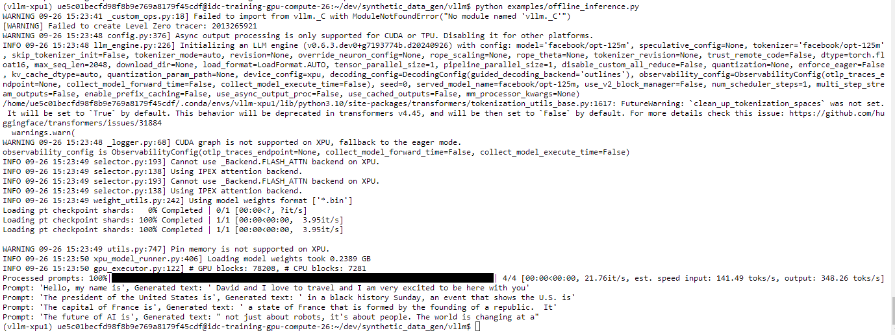

# vllm Setup for Intel XPUs

Below are set of instructions to setup vllm on Intel Hardware

- Verified: Intel Data Center GPU Max 1100
- Environment: Intel Tiber Developer Cloud

## Conda Environment Setup

```bash
conda create -n vllm-xpu python=3.10 -y
conda activate vllm-xpu
```

## Install Intel Extension for PyTorch

Install the latest version of IPEX for XPUs from [here](https://intel.github.io/intel-extension-for-pytorch/index.html#installation?platform=gpu)

```bash
python -m pip install torch==2.3.1+cxx11.abi torchvision==0.18.1+cxx11.abi torchaudio==2.3.1+cxx11.abi intel-extension-for-pytorch==2.3.110+xpu oneccl_bind_pt==2.3.100+xpu --extra-index-url https://pytorch-extension.intel.com/release-whl/stable/xpu/us/
```

### Sanity Check for IPEX

```bash
python -c "import torch; import intel_extension_for_pytorch as ipex; print(torch.__version__); print(ipex.__version__); [print(f'[{i}]: {torch.xpu.get_device_properties(i)}') for i in range(torch.xpu.device_count())];"
```

## Install and Build vllm

```bash
git clone https://github.com/vllm-project/vllm.git
cd vllm/
git checkout v0.6.2 # Checkout the latest/stable version
python -m pip install --upgrade pip
python use_existing_torch.py # This will make sure to not update IPEX with stock versions
python -m pip install -v -r requirements-xpu.txt
python -m pip install setuptools_scm
VLLM_TARGET_DEVICE=xpu python setup.py install
```

### Run Sample with vllm

```bash
python examples/offline_inference.py # <vllm-repo>/examples/offline_inference.py
```

Output:

